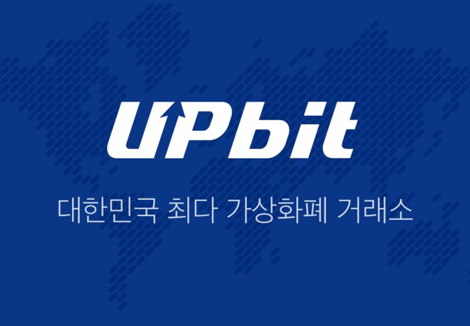

# upbit trading 



## Intro   
python 3.7.7 기반의 algorithmic trading  
알고리즘 트레이딩을 개발하여 수익을 내기보다는 데이터 분석 연습을 하는 데에 목적이 있습니다.  
[upbeat 개발자 센터](https://docs.upbit.com/)

## Install
```bash
pip install -r requirements.txt  
```

## Tips

- venv create
```bash
python -m venv .venv
.\.venv\Scripts\activate
```

- generate requirements.txt  
```bash
pip freeze > requirements.txt
```

- some lectures?  

[quantstart](https://www.quantstart.com/)  
[investopedia](https://www.investopedia.com/)  
[Python을 이용한 주가 백테스팅 시스템 구축하기](https://www.inflearn.com/course/python-%EC%A3%BC%EA%B0%80-%EB%B0%B1%ED%85%8C%EC%8A%A4%ED%8C%85#description)

## trouble shooting

- 거래가 안된다
  - ip 관련 문제
    - upbit api는 허용된 ip에서만 거래가 가능하도록 설정되어 있다. [Open API Key 관리](https://upbit.com/mypage/open_api_management) 하단 부분에 들어가 '허용 IP 주소'를 수정하여 사용하자.
    - 자신의 ip를 간단히 확인하는 방법으로, Open API Key의 상단 탭인 [접속 관리](https://upbit.com/mypage/access_management)에 들어가면 현재 로그인한 환경의 ip를 확인할 수 있다.
